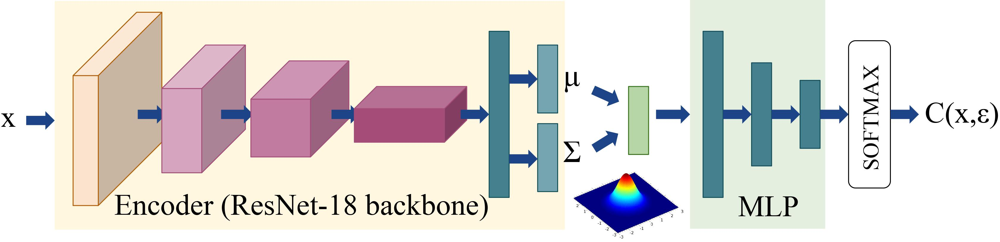

# Feature Level Stochastic Smoothing Classifier (FLSS)
This repository contains code for the implementation of our paper titled "Boosting Adversarial Robustness using Feature Level Stochastic Smoothing", accepted at CVPR Workshops 2021 (Safe AI for Automated Driving Workshop). Our paper is available here [main](https://openaccess.thecvf.com/content/CVPR2021W/SAIAD/papers/Addepalli_Boosting_Adversarial_Robustness_Using_Feature_Level_Stochastic_Smoothing_CVPRW_2021_paper.pdf) and [suppl](https://openaccess.thecvf.com/content/CVPR2021W/SAIAD/supplemental/Addepalli_Boosting_Adversarial_Robustness_CVPRW_2021_supplemental.pdf).

* We propose Adversarial training using a stochastic classifier, which enforces one of the feature layers to follow a predefined distribution, thereby facilitating sampling from the same during training and deployment.
* We propose Feature Level Stochastic Smoothing to achieve a boost in adversarial robustness over standard deterministic classifiers [PGD](https://arxiv.org/abs/1706.06083),  [TRADES](https://arxiv.org/abs/1901.08573)
* We propose a unified framework that combines the merits of adversarial training and detection, while also overcoming the shortcomings of both. We use the proposed stochastic classifier for rejecting low confidence samples, thereby resulting in a significant boost in adversarial robustness.
* We propose metrics to evaluate classifiers which improve robustness using adversarial training, while also incorporating a rejection scheme.
* We propose a scheme of combining our approach with Confidence-Calibrated Adversarial Training [CCAT](https://arxiv.org/abs/1910.06259), to achieve the merits of both.


# Performance of FLSS on ensemble of attacks
The table shows the comparision of FLSS on different rejection schemes(Majority voting and Confidence Thresholding) for 10% false positive rate. FC represents the set of images correctly classified and unrejected for all the attacks, while FW is set of images wrongly classified for at least one of the attacks and R is the set of images rejected for at least one of the attacks. We use confidence thresholding to enforce rejection for the baselines. CCAT[1] + FLSS proves out as a novel combination to retain the robustness of FLSS and simultaneously decrease false positive rate to 1%.

 Method     | Thresholding | Acc_nat,NS↑ | Acc_nat,0%↑ | Acc_nat,10%↑ | Acc_adv,NS↑ | Acc_adv,0%↑ | Acc_adv,10%↑ | FC↑  | FW↓ |  R
 :--------------: | :--------: | :-----: | :----:| :----: | :----:| :---:| :---:| :----:|:----:|:----:
 PGD-AT | Confidence | 83.80  | 83.80 | 91.93 | 49.07 | 49.07 | 51.15 | 43.99 | 42.00 | 44.19 
 TRADES | Confidence | 81.77  | 81.77 | 90.26 | 49.43 | 49.43 | 51.85 | 44.13 | 40.97 | 44.34
 AWP | Confidence | 80.58  | 80.58 | 89.14 | 49.80 | 49.80 | 53.01 | 44.06 | 39.05 | 44.01
 CCAT | Confidence | 89.92  | 89.92 | 97.52 | 0.00 | 0.00 | 0.00 | 0.00 | 8.52 | 100.00
 FLSS (Ours) (SD=1) | Confidence | 80.51  | 80.51 | 89.10 | 50.64 | 50.64 | 54.06 | 42.28 | 35.84 | 42.18
 FLSS (Ours) (SD=2) | Confidence | 80.51  | 77.68 | 89.63 | 50.64 | 51.00 | 56.16 | 43.16 | 33.69 | 47.42
 CCAT + FLSS (Ours) | Conf. +Maj. Vote | 80.51  | - | 89.10 | 50.64 | - | 56.16 | 43.16 | 33.69 | 47.42
 
# Working  details
## Training
### CIFAR-10 
```
cd ./CIFAR10/Train
python train_cifar10.py
```
### CIFAR-100 
```
cd ./CIFAR100/Train
python train_cifar100.py
```

## Inference
### CIFAR-10 
```
cd ./CIFAR10/Eval
Find the threshold for x% FPR using count FP arg (deault 10% FPR)
cd ./Threshold_finder
python eval_test.py --model --count FP
cd ../Ensemble_attack
Run the ensemble attack after finding the threshold
python eval.py --model --attacks_to_run
If the attack arrays are already saved run 
python eval_final_ensemble.py --model --attacks_to_run
```
### CIFAR-100 
```
cd ./CIFAR100/Eval
Find the threshold for x% FPR using count FP arg (deault 10% FPR)
cd ./Threshold_finder
python eval_test.py --model --count FP
cd ../Ensemble_attack
Run the ensemble attack after finding the threshold
python eval.py --model --attacks_to_run
If the attack arrays are already saved run 
python eval_final_ensemble.py --model --attacks_to_run
```
FLSS Cifar10 and Cifar100 trained models are available in the saved_checkpoints folder.
# Environment Settings 
* Python 3.6.9
* PyTorch 1.7
* Torchvision 0.8.0
* Numpy 1.19.2
# Citing this work
```
@InProceedings{Addepalli_2021_CVPR,
    author    = {Addepalli, Sravanti and Jain, Samyak and Sriramanan, Gaurang and Babu, R. Venkatesh},
    title     = {Boosting Adversarial Robustness Using Feature Level Stochastic Smoothing},
    booktitle = {Proceedings of the IEEE/CVF Conference on Computer Vision and Pattern Recognition (CVPR) Workshops},
    month     = {June},
    year      = {2021},
    pages     = {93-102}
}
